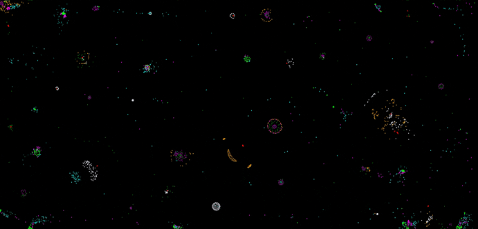

## digital-zoo

Build your own digital lifeforms - Self organinsing digital 'entities' , a taste of things to come...

## credits

Forked from Particle_life @  https://github.com/hunar4321/particle-life , an absolute 'Genius' example work of coding by the Author of @ https://www.brainxyz.com/

The favicon would have been impossible (literally) without the use of 'Gifski' @  https://github.com/sindresorhus/Gifski
****************************************************************************************************************************************************************************

  

*****************************************************************************************************************************************************************************
## Demo

View the live demo here @ https://psicodata.io/digital%20zoo/   and build you own amazing self organizing digital entities , the 'units' form into 'clusters' displaying

remarkable self organization , caused by the universal laws of attraction and repulsion... Displaying attributes that can only be described as 'Emergant Phenomenon'.

Adjust settings with pinpoint accuracy , Track clusters , dislpay inter-relationships by drawing lines between atoms in a similay was to particles.js , make video's

of your 'pet' forms and export at the click of a button... Alter the number of colours on screen and the number of atoms per colour , watch some clusters for into digital versions of

simple cellular organisms while others display 'preditory' behaivior. Witness formations display remarkable similarities with cosmological phenomena.

No two experiments are the same ,unless you load pre-set templates ,due to the intricate complexity of the environs...And the possible permutations.

Although the Zoo is a novel place to spend some downtime ,it raises some serious questions regarding the origins of life it's self in relation the the emergence of complexity

from simplicity ...
*********************************************************************************************************************************************************************************
                                                                                                                                                                                
                                                                                                                                                                                    
                                                                                                                                                                                    
                                                                                                                                                                           
